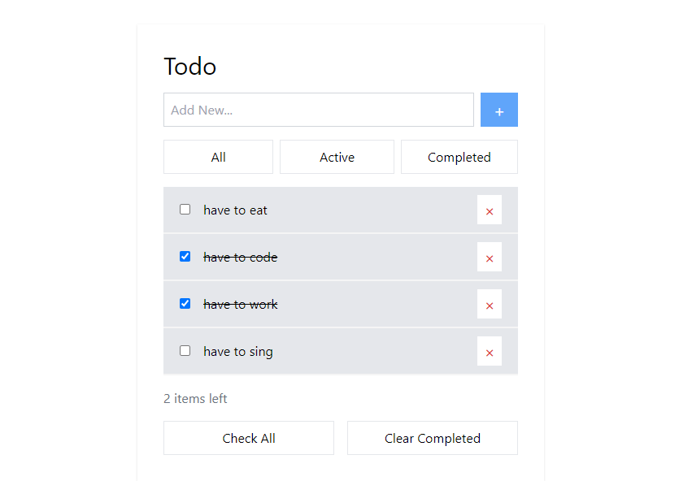

# Todo-Laravel-Vue Preview Image

## Generate API

/laravel_app/.env

DB_DATABASE=""
DB_USERNAME=""
DB_PASSWORD=""

php artisan migrate
php artisan serve

## Run Project

/vue_app

npm install
npm run serve

## Preview Image

